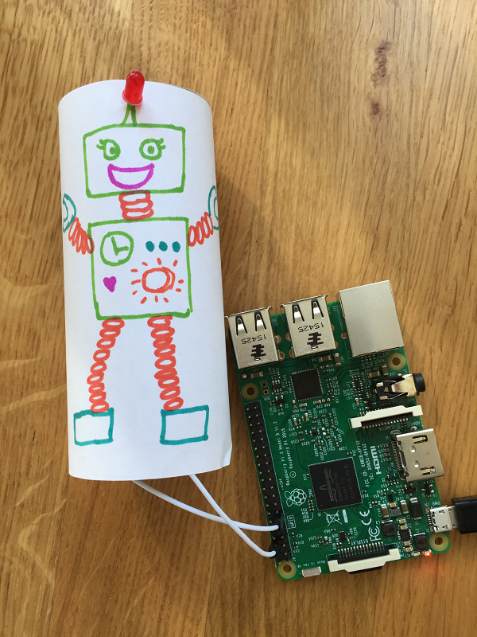

## Introduction
In this resource you will build a cardboard robot with a real flashing LED antenna, as well as using Scratch to create a robot twin that beeps.

### What you will make
Here is the robot we made:

### What you will learn
This resource covers elements from the following strands of the [Raspberry Pi Digital Making Curriculum](https://www.raspberrypi.org/curriculum/):

- [Design basic 2D and 3D assets](https://www.raspberrypi.org/curriculum/design/creator)
- [Use basic programming constructs to create simple programs](https://www.raspberrypi.org/curriculum/programming/creator)
- [Use basic digital, analogue, and electromechanical components](https://www.raspberrypi.org/curriculum/physical-computing/creator)
- [Use basic materials and tools to create project prototypes](https://www.raspberrypi.org/curriculum/manufacture/creator)
