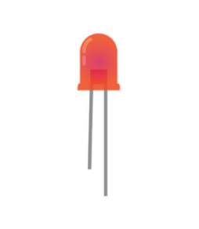
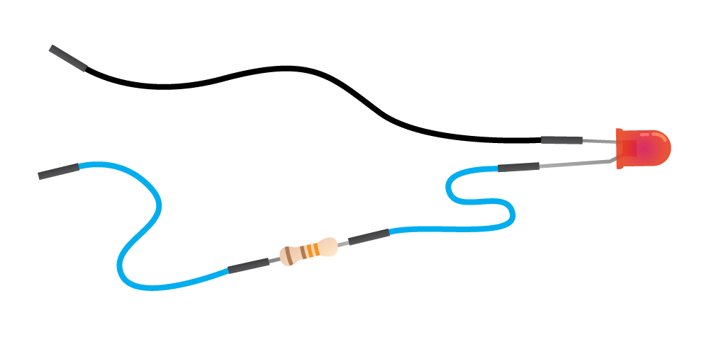

## Make an antenna

Let's get hands-on with electronics! First you will need to connect your light-emitting diode (LED) to some jumper wires and a resistor.

+ First, look at your LED. The LED has a short leg and a long leg.

+ Slot a jumper wire onto the end of the long leg.

+ Slot the resistor into the other end of the same jumper wire. It doesn't matter which way round it goes.

+ Add another jumper wire to the other end of the resistor.

+ Take another jumper wire and slot one end onto the short leg of the LED.

You should end up with something that looks like this:

