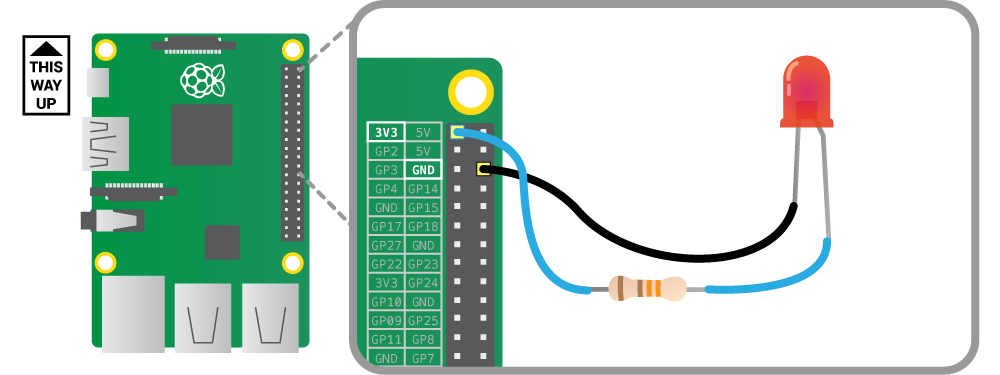

## Making an antenna for your robot with an LED

Let's get hands-on with electronics!  This is where the Raspberry Pi comes in handy. You will program a light-emitting diode (LED) to flash. First you will need to make a circuit. 

-  The LED has a short leg and a long leg. Slot a jumper wire onto the long leg.

2.  Slot the resistor into the other end of the same jumper wire.

3.  Add another jumper wire the other end of the resistor.

4.  Take another jumper wire and slot one end onto the short leg of the LED. You should end up with something that looks like this:

    

5.  Find the first **3V3** pin and a **GND** pin on your Raspberry Pi using the diagram below:

    

    The general purpose input ouput (GPIO) pins on the Raspberry Pi speak and listen to the outside world and can be          controlled or programmed.  Each pin has a specific role. To make life easier the pins are numbered for reference. A 3v3 pin is for power and GND pin is for grounding.

6.  Plug the resistor jumper wire into the 3V3 pin on your Raspberry Pi and the other jumper wire into the GND pin.

7.  Plug in the micro USB power supply and you should see some text appear on your screen.

### How the light antenna works

Now you have a circuit and the LED should be on. If it is not, make sure that you have plugged the jumper wires into the correct pins by checking the diagram above.

So, why does the LED shine?

When the circuit is plugged into the Raspberry Pi GPIO pins, electricity can flow through it. This flow is called the current. The LED only lights up when electric current flows from the long leg through the bulb to the short leg.

The resistor reduces the amount of electric current passing through the circuit. This protects the LED from breaking, as a high current would make the light shine more brightly and then stop working.

Well done! You've made the antenna for your robot. Now we need to do some programming to control it.

