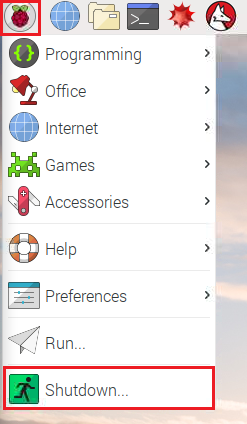
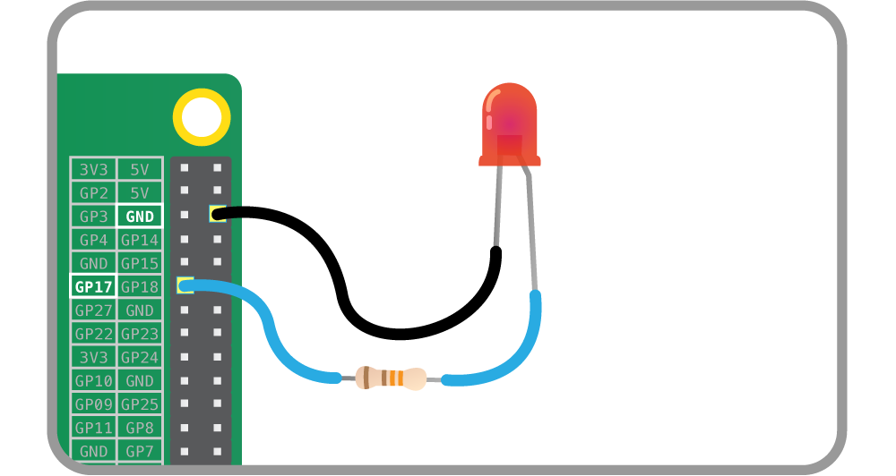
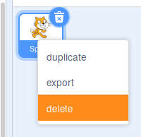

## Make the antenna flash with code

Now you have an antenna that lights up, let's write a program to tell the LED when to turn on and off.

--- task ---

Shut your Raspberry Pi down and remove the power cable.



--- /task ---

--- task ---

Move the jumper wire that is connected to the resistor from the **3V3** pin to the pin which is labelled **17** in the diagram below:



**Pin 17** is different to **3V3**: you can program it to switch the power on and off.

--- /task ---

--- task ---

Power on your Raspberry Pi and wait for it to boot.

--- /task ---

--- task ---

Open Scratch 2 by clicking on the menu and then **Programming**, followed by **Scratch 2**.


--- /task ---

--- task ---

Remove the Scratch cat by right-clicking on it and choosing **delete** from the menu.



--- /task ---

--- task ---

Click on the button for a new sprite and choose a robot from the **fantasy** folder, or, if you prefer, you can draw your own robot.

[[[generic-scratch-sprite-from-library]]]

--- /task ---

--- task ---

Click on **Events**. Drag the `when space key pressed`{:class="blockevents"} block into the Scripts area.

```blocks
when [space v] key pressed
```

--- /task ---

--- task ---

Click on **Sound**, drag the `play sound`{:class="blocksound"} block into the Scripts area and connect it to the previous block.

```blocks
when [space v] key pressed
+ play sound [ v]
```

--- /task ---

--- task ---

Add a sound for your robot. We chose the computer beeps from the **electronic** section.

[[[generic-scratch-sound-from-library]]]

--- /task ---

--- task ---

Go back to the Scripts tab. Click on the drop-down box in your `play sound`{:class="blocksound"} block and select the sound you just added.

```blocks
when [space v] key pressed
+ play sound [computer beeps v]
```

--- /task ---

--- task ---

Test that your program is working so far by pressing the **space** key. In response, your robot should beep!

--- /task ---

--- task ---

Save your work by clicking **File**, then **Save project**, and call it `robot.sb2`.

--- /task ---

Now let's program the LED to flash.

--- task ---

Enable the Pi GPIO extension. This will give you some extra blocks for programming the LED.

[[[rpi-scratch-add-pi-gpio]]]

--- /task ---

--- task ---

Select **More blocks** and then drag this block to the bottom of your script:

```blocks
set gpio [ v] to [output high v] :: extension
```

This block allows you to specify a GPIO pin, and whether it is on (`output high`) or off (`output low`).

--- /task ---

--- task ---

Select `17` from the gpio dropdown to specify pin 17, and leave the next drop-down on `high`. This block will turn your LED on.

```blocks
when [space v] key pressed
play sound [computer beeps v]
+ set gpio [17 v] to [output high v] :: extension
```

--- /task ---

--- task ---

Add a block to `wait 1 secs`{:class="blockcontrol"} from the control tab.

```blocks
when [space v] key pressed
play sound [computer beeps v]
set gpio [17 v] to [output high v] :: extension
+ wait (1) secs
```

--- /task ---

--- task ---

Now add another `set gpio` block, but this time ask it to set GPIO pin 17 to `low`.

```blocks
when [space v] key pressed
play sound [computer beeps v]
set gpio [17 v] to [output high v] :: extension
wait (1) secs
+ set gpio [17 v] to [output low v] :: extension
```

--- /task ---

--- task ---

Test your program by pressing the **space** key. You should see the LED turn on for a second and then turn off, and your robot should beep.

--- /task ---
