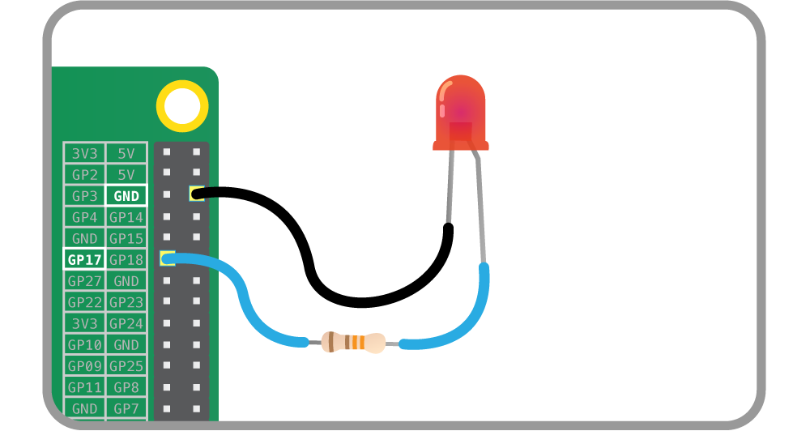
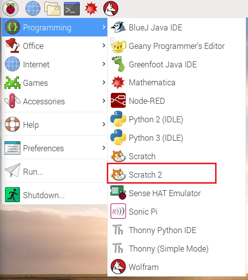

## Make the antenna flash with code

Now you have an antenna that lights up, let's write a program to tell the LED when to turn on and off.

+  Shut your Raspberry Pi down and remove the power cable.

+ Move the jumper wire that is connected to the resistor from the 3V3 pin to GPIO pin 17 which is labelled in the diagram below:



GPIO pin 17 is different to 3v3 as you can program it to switch the power on and off.

+ Power on your Raspberry Pi and wait for it to boot.

+ Open Scratch 2 by clicking on **Menu** and **Programming**, followed by **Scratch 2**.



+ Right-click on the Scratch cat and choose **delete** from the menu.

- Click on the button for a new sprite and choose a robot from the **fantasy** folder, or if you prefer you could draw your own robot.

[[[generic-scratch-sprite-from-library]]]

- Click on **Events**. Drag the ```when space key pressed```{.blockevents} block onto the scripts area.

+ Click on **Sound** and drag the ```play sound```{.blocksound} block onto the scripts area and connect it to the previous block.


+ Add a sound for your robot. We chose the computer beeps from the **electronic** section.

[[[generic-scratch-sound-from-library]]]

-  Go back to the scripts tab. Click on the drop down box in your ```play sound```{.blocksound} block and select the sound you just imported.

- Test that your program so far is working by pressing space key. Your robot should beep!

- Save your work by clicking **File** then **Save project** and call it `robot.sb2`.

Now let's program the LED to flash

+ Enable the Pi GPIO extension. This will give us some extra blocks to program the LED with.

[[[rpi-scratch-add-pi-gpio]]]

+ Select **More blocks** and then drag this block onto the bottom of your script


This block allows you to specify a GPIO pin, and whether it is on (high) or off (low).

+ Type `17` into the circle to specify GPIO pin 17, and leave the drop down on high. This block will turn your LED on.

+ Add a ```wait 1 second```{.blockcontrol} block

+ Now add another ```set gpio```{.blockmoreblocks} block, but this time ask it to set GPIO pin 17 to low.

- Test your program by clicking on the robot sprite. You should see the LED blink on then off, and your robot should beep.
