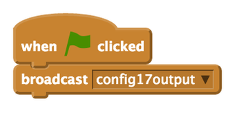
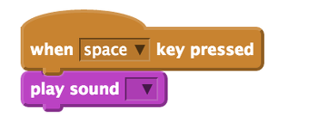
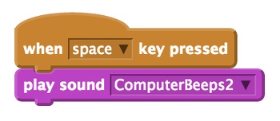
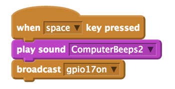
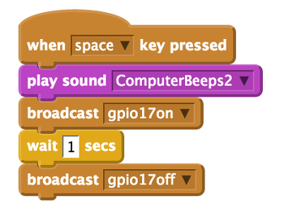

## Make the antenna flash with code

Now you have an antenna that lights up, you can write a program to tell the LED when you want it to be on.

For this section you will need to use pin **17** rather than 3V3 to power your LED. Pin 17 is special as it can switch power on and off – if you tell it to! Follow the instructions below to learn how to switch pins.

-  Shut your Raspberry Pi down and remove the power cable. Move your jumper wire that is connected to a resistor from 3V3 pin to the GPIO pin 17. See the diagram below to make sure that your circuit is correct:

    

-  Connect the power cable to the Raspberry Pi and wait for it to boot.

-  Open Scratch by clicking on **Menu** and **Programming**, followed by **Scratch**.

-  Click on **Edit** and **Start GPIO server** if it has not been started already.  

    

-  Right-click on the Scratch cat and choose **delete** from the menu.

- Then click on the button for a new sprite and choose **robot3** from the **fantasy** folder.

    

- Click on **control**. Drag the `when green flag clicked` block onto the scripts area. Then connect a `broadcast` block underneath. Click on the drop down menu on the broadcast block and select **new**.

    In the message name box type `config17output` This instruction will tell the Raspberry Pi that pin 17 will be an output. This is because you are telling the pin to turn on an off an LED which is an output component. 
    
    

- Drag the `when space key pressed` block onto the scripts area. Then click on **Sound** and drag the `play sound` block onto the scripts area and connect it to the control block.

    

-  Click on the **Sounds** tab above the scripts area and then click on **Import**. Choose **Electronic** and then **ComputerBeeps2**. This will add it to the sounds tab.

-  Now go back to the scripts area by clicking on the scripts tab. Click on the drop down box next to play sound. Choose the sound you just imported from the menu.

    

- Test that your program so far is working, by pressing space key. It should beep!

- Save your work so far by clicking on **File** and **Save As**. Name your file **Robot** and click **OK**.

- Click on the **control** in the blocks palette and drag a `broadcast` block to your scripts area and attach it to the play sound block. Click on the drop down menu on the broadcast block and select **new**.

    In the message name box type `gpio17on` This instruction will tell the Raspberry Pi to light the LED.

    

- Drag a `wait 1 second` block onto the scripts area and connect it to the broadcast block.

- Test your program by clicking on the robot sprite. You should see the LED shine and stay on.

- Drag another `broadcast` block onto your scripts area and connect it to the wait 1 second block. Click on the drop down menu on the broadcast block and select **new**.

    In the message name box type `gpio17off` This will switch off the LED.

- Now add another `wait 1 second` block to the script.

- Test your program again by clicking on the robot sprite. You should see the LED turn on for one second and turn off for one second.

    

