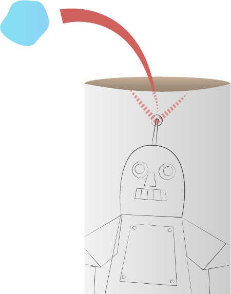

## Make a cardboard robot

Let's make a cardboard robot to display the antenna you've made.

--- task ---

On a sheet of A4 paper, draw or print your own robot design. It doesn't have to be a person robot — maybe it could be a car or an animal! Just make sure it has an antenna.

--- /task ---

--- task ---

Colour in the robot picture and cut it out carefully.

--- /task ---

--- task ---

Wrap the robot around the cardboard tube lengthways.

--- /task ---

--- task ---

Glue or tape the robot in place.

--- /task ---

--- task ---

Stick some modelling clay behind the robot's antenna inside the cardboard tube.

--- /task ---

--- task ---

Push a pencil into the antenna to make a hole through the cardboard tube.

--- /task ---

--- task ---

Remove the modelling clay.

--- /task ---

--- task ---

Put your circuit of jumper wires, LED, and resistor inside your cardboard tube. Push your LED through the hole in the tube to make the robot's antenna.

--- /task ---

--- task ---

Give your robot a name and welcome it to the world!

--- /task ---
