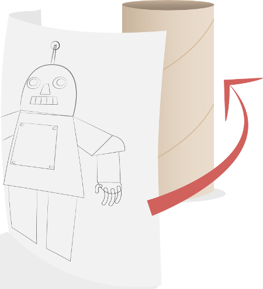
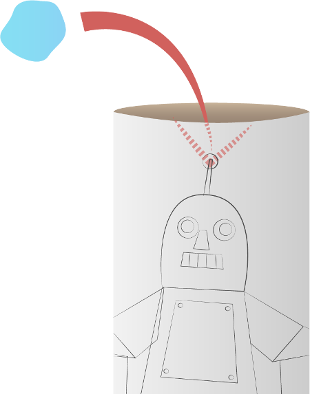
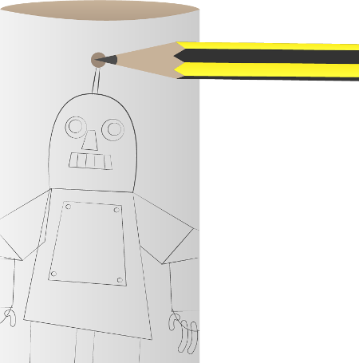

## Make a cardboard robot

Let's make a cardboard robot to display the antenna you've made.

+ On a sheet of A4 paper, draw or print your own robot design. It should be drawn portrait so it can be wrapped around your cardboard tube. Make sure it has an antenna!

+  Colour in the robot picture and cut it out carefully.

+  Wrap the robot around the cardboard tube lengthways.

+  Glue or tape the robot in place.

+  Stick some modelling clay behind the robot's antenna inside the cardboard tube.

+  Push a pencil into the antenna to make a hole through the cardboard tube.

+  Remove the modelling clay.

+  Put your circuit of jumper wires, LED, and resistor inside your cardboard tube. Push your LED through the hole in the tube to make the robot's antenna.

+  Give your robot a name and welcome it to the world.
