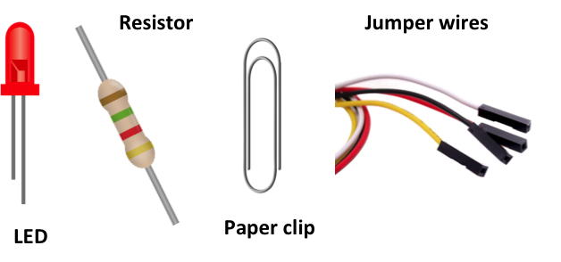
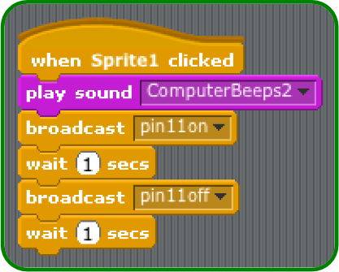

# Robot Antenna

We are going to make a robot that beeps and has a flashing antenna using a Raspberry Pi.

## Making an antenna for your robot

Let's get hands on with electronics!  This is where the Raspberry Pi comes in handy. You will program a small light called a LED (Light Emitting Diode) to flash.

You will need a coloured LED, a straightened paper clip (non plastic coasted), a 220 ohm resistor and 4 female to female jumper wires.



1.  The LED has a short leg and a long leg. Slot a jumper wire onto the long leg.

2.  Slot the resistor into the other end of the same jumper wire.

3.  Add another jumper wire the other end of the resistor.

4.  Make another jumper wire and slot one end onto the short leg of the LED, and the other end onto the paper clip (unfolded).

5.  Find pin 1 and pin 6 on your Raspberry Pi using the diagram below:

    

    The general purpose input ouput (GPIO) pins on the Raspberry Pi speak and listen to the outside world and can be          controlled or programmed.  Each pin his a specific role. To make life easier the pins are numbered for reference.         Pin 1 is for power. Pin 6 is for grounding.

6.  Plug the resistor jumper wire into pin 1 on your Raspberry Pi and the paperclip jumper wire into pin 6.

7.  Plug in the micro USB power supply and you should see some text appear on your screen.

**How the light antenna works:**

Now you have a circuit and the LED should be on. But why does the LED shine?

When the circuit is plugged into the Raspberry Pi GPIO pins, electricity flows through the circuit. The flow is called the current.

The LED lights up only when electric current flows from the long leg through the bulb to the short leg.

The resistor reduces the amount of electric current passing through the circuit. This protects the LED from breaking, as a high current will make the light shine more brightly and then stop working.

## Make the antenna flash

Now you have an antenna that lights up, and it is connected to your Raspberry Pi, you can write a program to tell the LED when you want it on.

For this section you will need to use pin 11 rather than pin 1 to power your LED. Pin 11 is special as it can switch power on and off – if you tell it to!

1.  Switch off the power to the Raspberry Pi. Move your jumper wire from pin 1 to pin 11. (Use the diagram from earlier to locate pin 11. Then switch the power back on.

2.  When prompted to login type:

    ```
    Login: pi
    Password: raspberry
    ```

3.  Once you have logged in, type `startx` to load the desktop.

4.  The desktop should have a **ScratchGPIO** icon. Double click it.

5.  If prompted click **OK** when the remote sensor connections are enabled.

    

6.  Right-click on the Scratch cat and choose **delete** from the menu.

    Then click on the button for a new sprite and choose **robot3** from the **fantasy** folder.

    

7.  Click on **control** in the top left display. Drag the **when Sprite1 clicked** block onto the scripts area. Then click on **Sound** and drag the **play sound** block onto the scripts area and connect it to the control block.

    

8.  Click on the **Sounds** tab above the scripts area and then click on **Import**. Choose **Electronic** and then **ComputerBeeps2**. This will add it to the sounds tab.

9.  Now go back to the scripts area by clicking on the scripts tab. Click on the drop down box next to play sound. Choose the sound you just imported from the menu.

    

10. Test that your program so far is working, by clicking on the robot sprite. It should beep!

11. Save your work so far by clicking on **File** and **Save As**. Name your file **Robot** and click **OK**.

12. Click on the **control** in the blocks palette and drag a **broadcast** block to your scripts area and attach it to the play sound block. Click on the drop down menu on the broadcast block and select **new**.

    In the message name box type **pin11on** This instruction will tell the Raspberry Pi to light the LED.

    

13. Drag a **wait 1 second** block onto the scripts area and connect it to the broadcast block.

14. Test your program by clicking on the robot sprite. You should see the cardboard robot's antenna light shine and stay on.

15. Drag another **broadcast** block onto your scripts area and connect it to the wait 1 second block. Click on the drop down menu on the broadcast block and select **new**.

    In the message name box type **pin11off** This will switch off the light on the cardboard robot's antenna.

16. Now add another **wait 1 second** block to the script.

17. Test your program again by clicking on the robot sprite. You should see the light on the cardboard robot's antenna come on for 1 second and turn off for one second.

    

## Make a cardboard robot

You will make a cardboard robot and add your light antenna.

1.  On a sheet of A4 paper, draw or print your own robot design. It should be drawn portrait so it can be wrapped around your cardboard tube. Make sure it has an antenna!

2.  Colour in the robot picture and cut it out carefully.

3.  Wrap the robot around the cardboard tube length ways.

    

4.  Glue or tape the robot in place.

5.  Stick plasticine or blu tack behind the robot's antenna inside the cardboard tube.

6.  Push a pencil into the antenna to make a hole through the cardboard tube.

    

7.  Remove the plasticine.

8.  Put your circuit of jumper wires, LED, resistor and paper clip inside your cardboard tube. Push your LED through the hole in the tube to make the robot's antenna.

9.  Give your Robot a name and welcome it to the world.

**Congratulations your robot is complete!**

## What next?

-   Can you make the cardboard robot's antenna stay on for longer?
-   Can you make the light flash more than once?
-   Record new sounds to play when your program plays.
