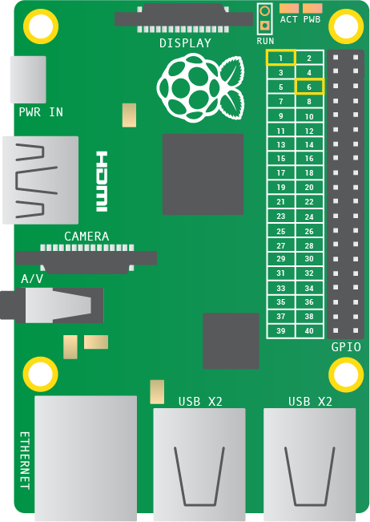
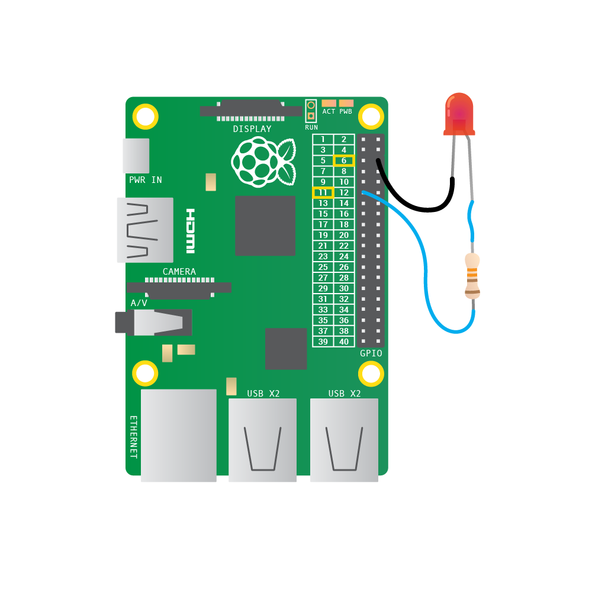
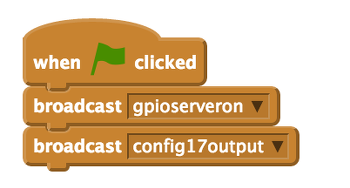
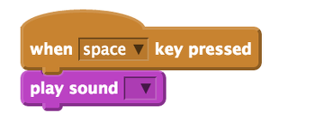
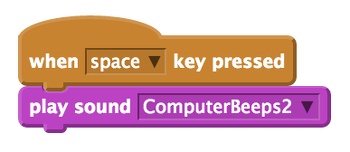
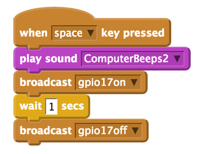
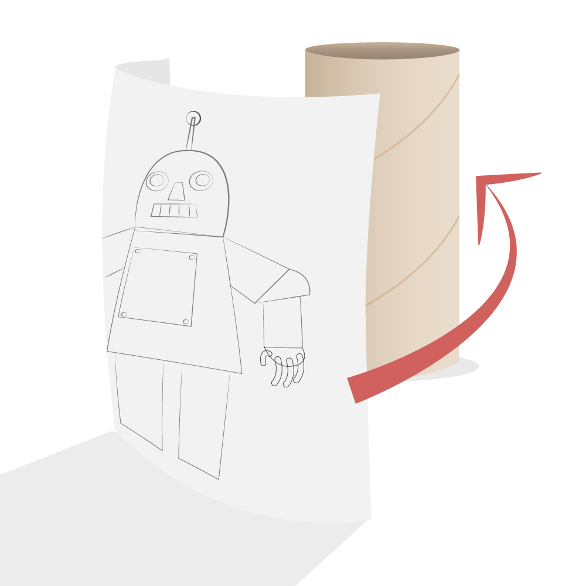
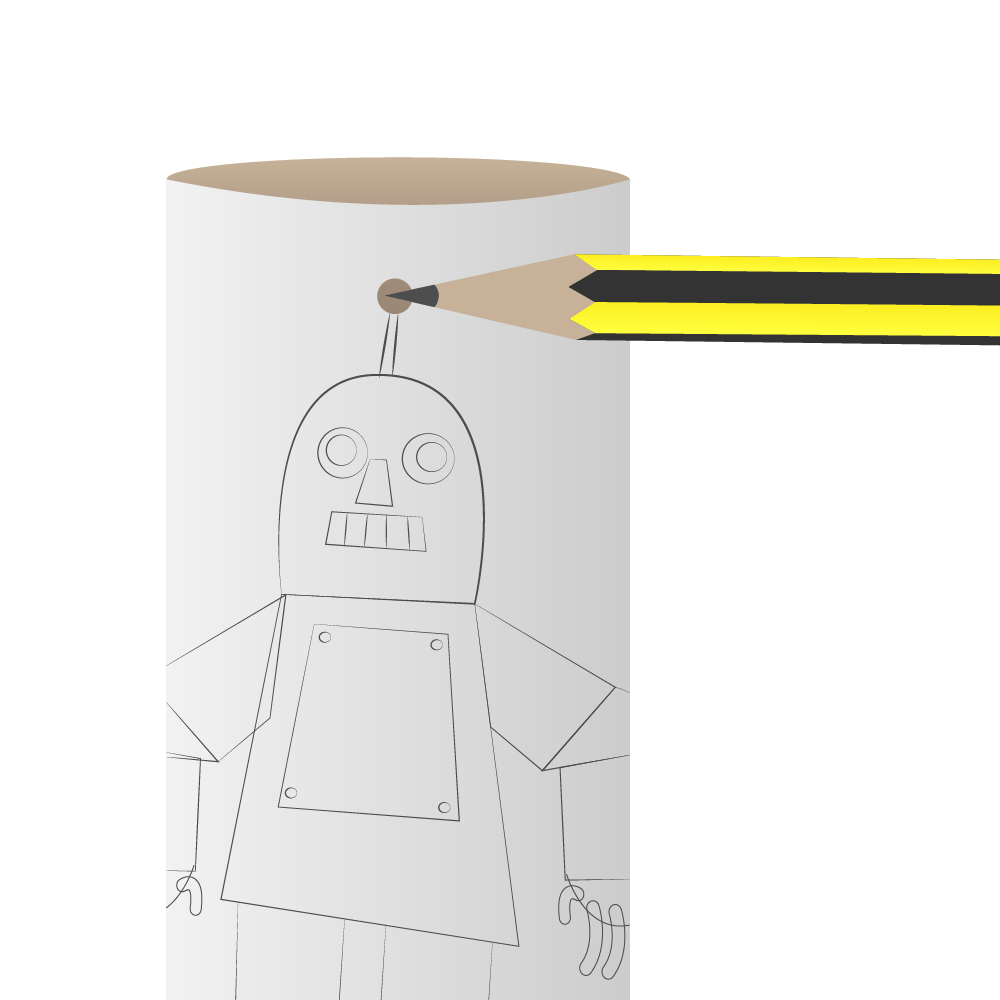

# Robot Antenna

We are going to make a robot which beeps and has a flashing antenna using a Raspberry Pi.

## Making an antenna for your robot with an LED

Let's get hands-on with electronics!  This is where the Raspberry Pi comes in handy. You will program a small light called a LED (Light Emitting Diode) to flash. First you will need to make a circuit. 

1.  The LED has a short leg and a long leg. Slot a jumper wire onto the long leg.

2.  Slot the resistor into the other end of the same jumper wire.

3.  Add another jumper wire the other end of the resistor.

4.  Take another jumper wire and slot one end onto the short leg of the LED. You should end up with something that looks like this:

    

5.  Find the first `3v3` pin and a `GND` pin on your Raspberry Pi using the diagram below:

    

    The general purpose input ouput (GPIO) pins on the Raspberry Pi speak and listen to the outside world and can be          controlled or programmed.  Each pin has a specific role. To make life easier the pins are numbered for reference. A `3v3` pin is for power and `GND` pin is for grounding.

6.  Plug the resistor jumper wire into the `3v3` pin on your Raspberry Pi and the other jumper wire into the `GND` pin.

7.  Plug in the micro USB power supply and you should see some text appear on your screen.

### How the light antenna works

Now you have a circuit and the LED should be on. If it is not, make sure that you have plugged the jumper wires into the correct pins by checking the diagram above.

So, why does the LED shine?

When the circuit is plugged into the Raspberry Pi GPIO pins, electricity can flow through it. This flow is called the current. The LED only lights up when electric current flows from the long leg through the bulb to the short leg.

The resistor reduces the amount of electric current passing through the circuit. This protects the LED from breaking, as a high current would make the light shine more brightly and then stop working.

Well done! You've made the antenna for your robot. Now we need to do some programming to control it.

## Make the antenna flash with code

Now you have an antenna that lights up, you can write a program to tell the LED when you want it to be on.

For this section you will need to use pin `17` rather than `3v3` to power your LED. Pin 17 is special as it can switch power on and off – if you tell it to! Follow the instructions below to learn how to switch pins.

1.  Shut your Raspberry Pi down and remove the power cable. Move your jumper wire that is connected to a resistor from `3v3` pin to the GPIO pin `17`. See the diagram below to make sure that your circuit is correct:

    

1.  Connect the power cable to the Raspberry Pi and wait for it to boot.

1.  Open Scratch by clicking on **Menu** and **Programming**, followed by **Scratch**.

1.  Click on **Edit** and **Start GPIO server** if it has not been started already.  

    

1.  Right-click on the Scratch cat and choose **delete** from the menu.

1. Then click on the button for a new sprite and choose **robot3** from the **fantasy** folder.

    

1. Click on **control**. Drag the `when green flag clicked` block onto the scripts area. Then connect a `broadcast` block underneath. Click on the drop down menu on the broadcast block and select **new**.

    In the message name box type `config17output` This instruction will tell the Raspberry Pi that pin 17 will be an output. This is because you are telling the pin to turn on an off an LED which is an output component. 
    
    

1. Drag the `when space key pressed` block onto the scripts area. Then click on **Sound** and drag the `play sound` block onto the scripts area and connect it to the control block.

    

1.  Click on the **Sounds** tab above the scripts area and then click on **Import**. Choose **Electronic** and then **ComputerBeeps2**. This will add it to the sounds tab.

1.  Now go back to the scripts area by clicking on the scripts tab. Click on the drop down box next to play sound. Choose the sound you just imported from the menu.

    

1. Test that your program so far is working, by pressing space key. It should beep!

1. Save your work so far by clicking on **File** and **Save As**. Name your file **Robot** and click **OK**.

1. Click on the **control** in the blocks palette and drag a `broadcast` block to your scripts area and attach it to the play sound block. Click on the drop down menu on the broadcast block and select **new**.

    In the message name box type `gpio17on` This instruction will tell the Raspberry Pi to light the LED.

    

1. Drag a `wait 1 second` block onto the scripts area and connect it to the broadcast block.

1. Test your program by clicking on the robot sprite. You should see the LED shine and stay on.

1. Drag another `broadcast` block onto your scripts area and connect it to the wait 1 second block. Click on the drop down menu on the broadcast block and select **new**.

    In the message name box type `gpio17off` This will switch off the LED.

1. Now add another `wait 1 second` block to the script.

1. Test your program again by clicking on the robot sprite. You should see the LED turn on for one second and turn off for one second.

    

## Make a cardboard robot

You will make a cardboard robot and add your light antenna.

1.  On a sheet of A4 paper, draw or print your own robot design. It should be drawn portrait so it can be wrapped around your cardboard tube. Make sure it has an antenna!

2.  Colour in the robot picture and cut it out carefully.

3.  Wrap the robot around the cardboard tube length ways.

    

4.  Glue or tape the robot in place.

5.  Stick plasticine or blu tack behind the robot's antenna inside the cardboard tube.

    

6.  Push a pencil into the antenna to make a hole through the cardboard tube.

    

7.  Remove the plasticine.

8.  Put your circuit of jumper wires, LED, and resistor inside your cardboard tube. Push your LED through the hole in the tube to make the robot's antenna.

9.  Give your Robot a name and welcome it to the world.

**Congratulations! Your robot is complete!**

## What next?

-   Can you make the cardboard robot's antenna stay on for longer?
-   Can you make the light flash more than once?
-   Try recording new sounds to play when your program plays.
